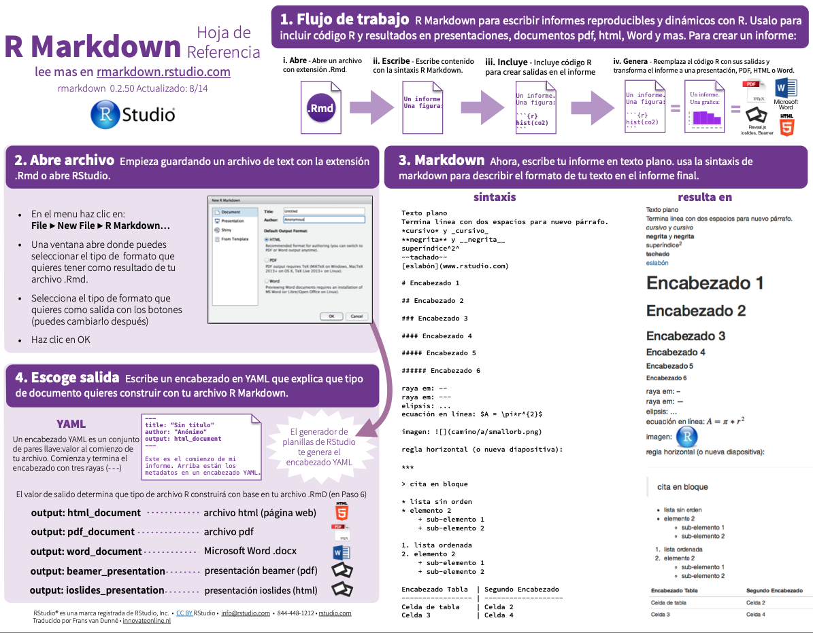
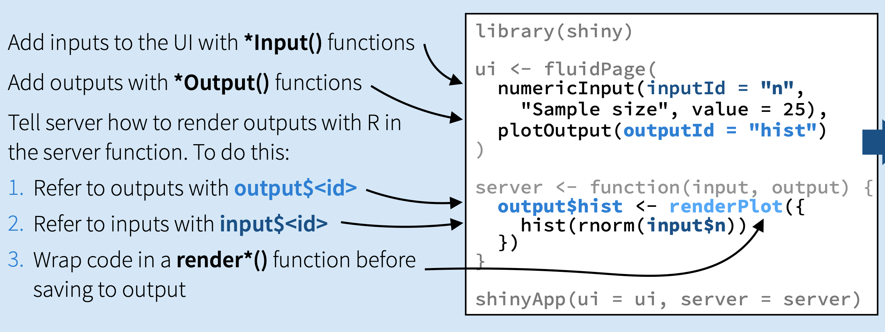
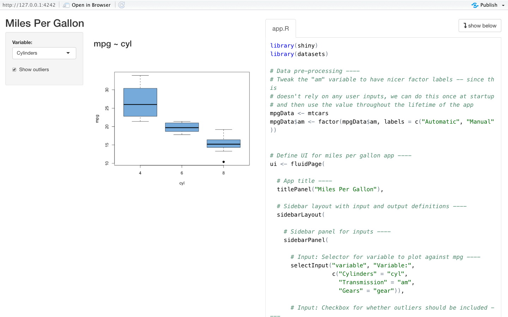

```{r setup, include=FALSE}
# load packages
library(pacman)
pacman::p_load(here,knitr,tidyverse,data.table,kable,kableExtra,shiny)

# option html
options(htmltools.preserve.raw = FALSE)
options(htmltools.dir.version = F)
opts_chunk$set(fig.align="center", fig.height=4 , dpi=300 , cache=F)
```

name: contenido
# Ya vimos..

- [Introducción a Web-scraping](https://github.com/taller-R/clase-14)

--

# Hoy veremos 

1. [Introducción a Rmarkdown](#rm)

2. [Introducción a Shiny](#shiny)

    
<!----------------------------------->
<!--- Introducción a Rmarkdown --->
<!----------------------------------->
---
class: inverse, center, middle
name: intro

# [1. Introducción a Rmarkdown](#rm)

<html><div style='float:left'></div><hr color='#FF007F' size=1px width=796px></html>

---
# 1.1. ¿Que es R Markdown?

Markdown es un lenguaje de marcado que facilita la aplicación de formato a un texto empleando una serie de caracteres de una forma especial. En R podemos integrar este leguaje para generar informes y documentos automatizados.

# 1.2. Elementos de un archivo .Rdm 

Podemos identificar tres elementos dentro de un archivo .Rdm:

+ Encabezado: Esta parte del .Rdm se encuentra al inicio del documento y está contenido en los siguientes caracteres `---`. Allí se deben escribir todas las funciones que permitan asignar la configuración deseada a mi documento.

+ Texto: Mientras en R el formato primario son las funciones, en R Markdown se considera el texto plano como el formato primario. Al momento de compilar R Markdown lo define como *ordinary text without R code*. 

+ Código: Está compuesto por todas las líneas de código que se ejecutan en la consola de R y que permiten obtener los resultados que se muestran en el *output* del .Rdm. 

---
# 1.3. Encabezado YAML

Como mencionamos anteriormente, este va al inicio de nuestro documento y determina los parámetros generales del reporte a compilar. 

- **HTML**
```{r,eval=F}
---
title: "Introducción a R Markdown" 
subtitle: "Taller de R, clase 15"
author: "Eduard Martinez"
date: "5/20/2020"
output: html_document
---
```

- **LaTeX**
```{r,eval=F}
---
title: "Introducción a R Markdown" 
subtitle: "Taller de R, clase 15"
author: "Eduard Martinez"
date: "5/20/2020"
header-includes:    
      - \usepackage{float} 
output: pdf_document
---
```

---
# 1.4. Hoja de referencia

[Aquí](https://rstudio.com/wp-content/uploads/2015/03/rmarkdown-spanish.pdf) puede encontrar la hoja de referencia de R Markdown.

<div align="center">

</div>

---
# 1.5. Help

Vamos a la pagina de [https://rmarkdown.rstudio.com](https://rmarkdown.rstudio.com/authoring_basics.html) y revisemos las sintaxis básicas de R Markdown. En las siguientes páginas web podemos encontrar material de apoyo que nos sirve para iniciar con R Markdown. 

+ [Bookdown](https://bookdown.org/gboccardo/manual-ED-UCH/introduccion-al-uso-de-rmarkdown-para-la-compilacion-de-resultados-de-rstudio-en-diferentes-formatos.html) 

+ [r4ds](https://es.r4ds.hadley.nz/r-markdown.html)

+ [Bookdown](https://bookdown.org/yihui/rmarkdown/notebook.html#using-notebooks)

+ [kableExtra](https://cran.r-project.org/web/packages/kableExtra/vignettes/awesome_table_in_html.html#CellText_Specification)

<!---------------------------->
<!--- Introducción a Shiny --->
<!---------------------------->
---
class: inverse, center, middle
name: example
# [2. Introducción a Shiny](#shiny)

<html><div style='float:left'></div><hr color='#FF007F' size=1px width=796px></html>

---
# 2.0. Qué es una dashboard de Shiny?

Un shiny app o una dashboard, es una interfaz de usuario (UI) conectada a una seccion de R corriendo en una computadora (server): 
<div align="center">

</div>
Tomado de: [http://juliawrobel.com](http://juliawrobel.com/tutorials/images/what_is_shiny.png)

---
# 2.1. Imputs de shiny

<div align="center">

</div>

Podemos ver la hoja de referencia de Shiny [aquí](https://shiny.rstudio.com/images/shiny-cheatsheet.pdf).

---
# 2.2. Help
Veamos algunos ejemplos de Shiny: [https://github.com/rstudio/shiny-examples](https://github.com/rstudio/shiny-examples)

```{r, eval=F}
library(shiny)
runExample(example = "04_mpg")
```

<div align="center">

</div>

---
# 2.3. Alojar la app en el host de shiny

1. Ir a [https://www.shinyapps.io](https://www.shinyapps.io)

2. Crean un usuario y una contraseña  (preferiblemente usen el correo de su cuenta de GitHub).

3. Generen un dominio para su cuenta (yo uso eduard-martinez, el nombre de mi usuario en GitHub).

4. Obtener un tocken.

5. Publicar app.

<!--------------------->
<!---    Hoy vimos  --->
<!--------------------->
---
class: inverse, center, middle
name: view

# [Hoy vimos...](#contenido1)
<html><div style='float:left'></div><hr color='#FF007F' size=1px width=796px></html>

---
#  Hoy vimos...

- ☑ [Introducción a Rmarkdown](#rm)

- ☑ [Introducción a Shiny](#shiny)


